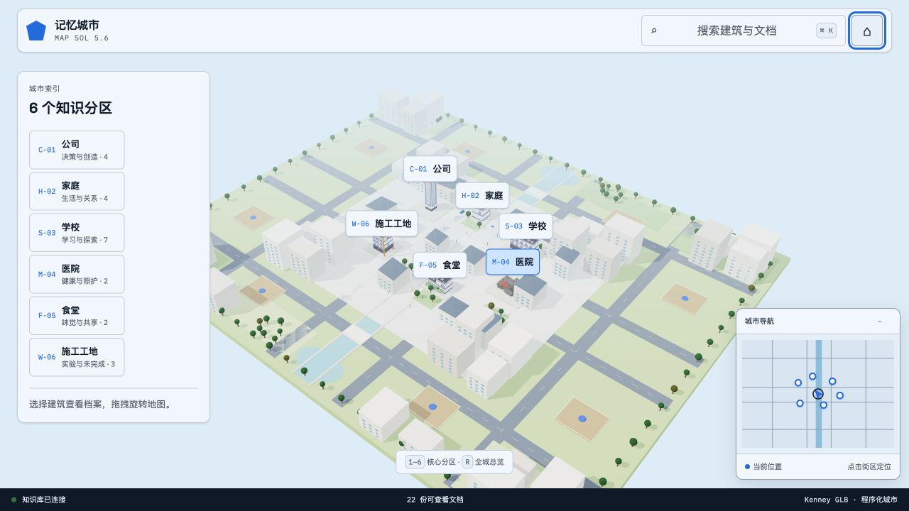

# Metrobsidian

[English](./README.md)

> 把文件、笔记与本地 Agent，变成一座可以进入的城市。

Metrobsidian 是一个本地优先的 3D 知识空间原型。它把 Markdown 文件夹转成可漫游城市：知识分类成为街区，文档成为可打开对象，Agent 则在同一空间中阅读、整理并留下任务轨迹。



## 它在验证什么

常规知识工具依赖列表、文件夹和搜索。Metrobsidian 尝试另一套界面：稳定地点、空间关系、可见生长，以及“工作发生在哪里”清晰可见的 Agent。

核心实验包括：

- **知识成为地点**：建筑、街区、小地图和搜索共同导航同一批内容。
- **本地优先摄入**：FastAPI 服务只扫描明确授权目录，不修改原文件。
- **场景独立演进**：城市与室内空间分别构建，不把全部逻辑塞进全局入口。
- **Agent 进入世界**：本地 Agent 读取受限上下文，并把过程写成可审计 Markdown。

## 仓库结构

```text
Metrobsidian/
├── apps/
│   ├── city/                 # 3D 知识城市主应用
│   └── office/               # 公司与实验室场景
├── services/
│   ├── knowledge/            # 文件摄入与分类
│   ├── generation/           # 可选的图片→3D 适配层
│   ├── agent/                # 受限本地 Agent Runtime
│   └── collaboration/        # 本地 WebSocket 协作原型
├── content/
│   └── demo-knowledge-base/  # 已改写、已脱敏的演示知识
├── docs/                     # 架构与产品文档
└── serve-deep-city.mjs       # 统一预览两个前端构建产物
```

所有可选服务默认只监听 `127.0.0.1`。不启动任何后端，也能浏览仓库内演示内容。

## 快速运行

需要 Node.js `22.12+`、npm `10+`，以及支持 WebGL 的浏览器。

```bash
npm install
npm run dev:city
```

打开 `http://127.0.0.1:5173`。

公司内部是独立应用，另开终端运行：

```bash
npm run dev:office
```

地址为 `http://127.0.0.1:5174/office.html`。生产构建可统一到同一地址：

```bash
npm run build
npm run serve
```

打开 `http://127.0.0.1:5190`。

## 可选本地服务

```bash
cp .env.example .env.local
python3 -m venv services/knowledge/.venv
source services/knowledge/.venv/bin/activate
pip install -r services/knowledge/requirements.txt
```

按需启动：

```bash
npm run service:knowledge
npm run service:generation
npm run service:collaboration
npm run service:agent
```

生图、图生 3D 与模型调用都不是主城市的硬依赖。密钥只放 `.env.local`，不要把本地服务暴露到不可信网络。

## 验证

```bash
npm test
npm run build
npm run check:public
```

CI 会执行 Node 测试、Python 测试、两个前端生产构建和公开仓库扫描。

## 公开边界

`content/demo-knowledge-base/` 是经过重写的演示材料，不是原始个人知识库。禁止提交客户文件、精确地址、账号信息、私人日志、本地数据库、原始上传内容或密钥。新增演示内容应按“可公开源材料”审阅，而非只做表面打码。

继续开发前，请阅读 [`SECURITY.md`](./SECURITY.md)、[`CONTRIBUTING.md`](./CONTRIBUTING.md) 与 [`THIRD_PARTY_NOTICES.md`](./THIRD_PARTY_NOTICES.md)。

## 状态

这是研究原型，不是多租户线上产品。当前重点是减轻交互、收紧服务边界，并验证空间组织何时真正优于文件夹与搜索。
